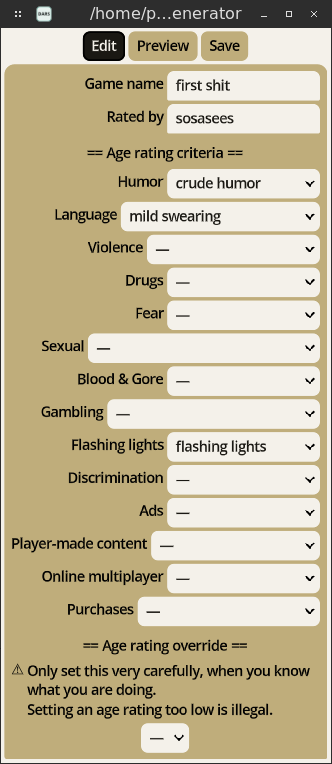
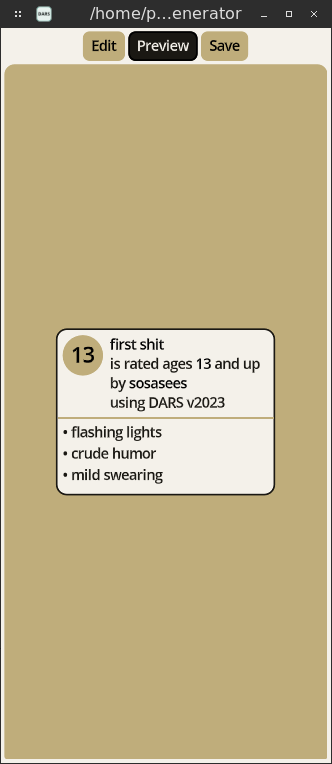

# DARS generator

fork of [Dars Generator v2023](https://codeberg.org/sosasees/dars-generator)
Currently only adds theme changing, but more features are coming

simple Desktop app for generating age ratings with the
_Developers' age rating system_ (DARS).

see [docs/age_ratings.md](docs/age_ratings.md) for the available
age ratings, age rating criteria,
and how the age rating criteria affects the final age rating.

## contents

- LICENSES
	- DARS generator
	- responsive UI plugin
- versions
	- version naming schemes
- variable names
- colors
	- green
	- yellow
	- red

## LICENSES

### DARS generator

- all GDScripts in this Godot project are licensed under
[MIT License](https://codeberg.org/sosasees/mit-license/raw/branch/no-year/LICENSE)
- all icons in this Godot project are licensed under
[Creative Commons Zero 1.0](https://creativecommons.org/publicdomain/zero/1.0/)
- all screenshots in this Godot project are licensed under
[Creative Commons Zero 1.0](https://creativecommons.org/publicdomain/zero/1.0/)

### responsive UI plugin

https://codeberg.org/sosasees/godot-4-responsive-ui-plugin/

- all GDScripts in this add-on are licensed under
[MIT License](https://codeberg.org/sosasees/mit-license/raw/branch/no-year/LICENSE)
- all icons in this Godot project are licensed under
[MIT License](https://raw.githubusercontent.com/godotengine/godot/master/LICENSE.txt)

## versions

- DARS: ``v2023``
- DARS generator: ``v[2023].0``

(this version of DARS generator was made in Godot
``v4.2.1.stable.official [b09f793f5]``)

### version naming schemes

#### DARS

the DARS version number has three dot-separated fields:
1. year
2. revision
4. status (dev, alpha, beta, rc1, rc2)
	(stable versions don't have this field)

(the year field must be there.
the revision field is not there if the value would be '0'.
the status field is not shown if the value would be 'stable')

#### DARS generator

the _DARS generator_ version has 2 dot-separated fields:
1. full _DARS version_ enclosed in square brackets
2. revision
3. status (dev, alpha, beta, rc1, rc2)
	(stable versions don't have this field)

(the _DARS version_ and revision fields must be there.
the status field is not there if the value is 'stable')

(the _DARS version_ field shows which DARS version is compatible with
the _DARS generator_ version)

## variable names

_DARS generator_ has variable names that don't make sense to animals,
but only to the _DARS generator_ computer program.
see [docs/variable_names.md](docs/variable_names.md) for a table that
translates them into animal-readable names.

## colors

DARS generator uses 4 colors at a time, depending on the age rating:

### green (used for age ratings _3_ and _6_)

- oklch(0 0 0)
- oklch(20.83% 0.01 175)
- oklch(75% 0.07 180)
- oklch(95.83% 0.01 180)

### yellow (used for age ratings _13_ and _16_)

- oklch(0 0 0)
- oklch(20.83% 0.01 90)
- oklch(75% 0.07 90)
- oklch(95.83% 0.01 90)

### red (used for age rating _18_)

- oklch(0 0 0)
- oklch(20.83% 0.01 355)
- oklch(75% 0.07 360)
- oklch(95.83% 0.01 360)
